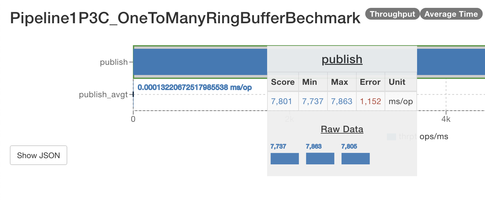

# Cafe ring-buffer


Developed a high-performance ring buffer leveraging low-level `unsafe` operations to optimize for speed, capable of processing and delivering over 10 million messages per second.

Benchmark `Unicast`: `1P – 1C`: Achieved the transfer of approximately 11,000 records with an average latency of 89 nanoseconds per record.


Benchmark `Three Step Pipeline`: `1P – 3C`: Achieved the transfer of approximately 7,500 records with an average latency of 132 nanoseconds per record.


## Features

- [X] `OneToManyRingBuffer` (also configurable for `OneToOneRingBuffer` usage)
- [ ] `ManyToOneRingBuffer`
- [ ] `ManyToManyRingBuffer`

## RingBuffer structure

### RingBuffer structure overview


### RingBuffer message structure


## Usage
A Simple Example (A Simple Example (to have the best performance, should reuse the `ByteBuffer` in `publish` and `consume`))

- Initialize the RingBuffer with a capacity of 1024 and a total of 2 consumers.
```java
OneToManyRingBuffer oneToManyRingBuffer = new OneToManyRingBuffer(10, 2);
```

- Publish a message to the `RingBuffer`.
```java
ByteBuffer messageBufferWriter = ByteBuffer.allocate(1 << 10);
ByteBufferUtil.put(messageBufferWriter, 0, "hello world!!".getBytes());
messageBufferWriter.flip();
oneToManyRingBuffer.write(1, messageBufferWriter);
```

- Consume messages in the first consumer on a dedicated thread.
```java
ByteBuffer messageBufferReader = ByteBuffer.allocate(1 << 10);
MessageHandler handler = (msgTypeId, buffer, index, length) -> {
    System.out.println("msgTypeId: " + msgTypeId);
    System.out.println("index: " + index);
    System.out.println("length: " + length);

    messageBufferReader.clear();

    buffer.getBytes(index, messageBufferReader, 0, length);
    messageBufferReader.position(length);
    messageBufferReader.flip();

    byte[] messageBytes = new byte[length];
    messageBufferReader.get(messageBytes);

    System.out.println("message: " + new String(messageBytes));
    Assertions.assertEquals(message, new String(messageBytes), "Message not match");

    return true;
};

oneToManyRingBuffer.read(0, handler);
```

- Consume a message from the second consumer on a separate thread.
```java
ByteBuffer messageBufferReader = ByteBuffer.allocate(1 << 10);
MessageHandler handler = (msgTypeId, buffer, index, length) -> {
    System.out.println("msgTypeId: " + msgTypeId);
    System.out.println("index: " + index);
    System.out.println("length: " + length);

    messageBufferReader.clear();

    buffer.getBytes(index, messageBufferReader, 0, length);
    messageBufferReader.position(length);
    messageBufferReader.flip();

    byte[] messageBytes = new byte[length];
    messageBufferReader.get(messageBytes);

    System.out.println("message: " + new String(messageBytes));
    Assertions.assertEquals(message, new String(messageBytes), "Message not match");

    return true;
};

oneToManyRingBuffer.read(1, handler);
```

## Setup

add `--add-opens java.base/java.nio=ALL-UNNAMED` as a JVM argument

## Reference

- `False sharing`:
  - https://trishagee.com/2011/07/22/dissecting_the_disruptor_why_its_so_fast_part_two__magic_cache_line_padding/
  - https://mechanical-sympathy.blogspot.com/2011/07/false-sharing.html
- `Happens before guarantee`: https://jenkov.com/tutorials/java-concurrency/java-happens-before-guarantee.html
- `Ring buffer`: https://aeron.io/docs/agrona/concurrent/#ring-buffers
