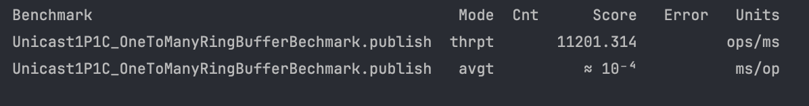
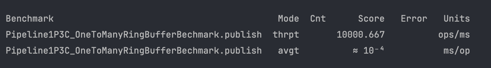

# Cafe ring-buffer

[](https://central.sonatype.com/artifact/io.github.gc-garcol/cafe-ringbuffer)
[](https://javadoc.io/doc/io.github.gc-garcol/cafe-ringbuffer)

Developed a high-performance ring buffer leveraging `lock-free` and low-level `unsafe` operations to optimize for speed, capable of processing and delivering over 10 million messages per second.


## Table of Contents
- [Benchmark](#benchmark)
- [Features](#features)
- [RingBuffer structure](#ringbuffer-structure)
  - [RingBuffer structure overview](#ringbuffer-structure-overview)
  - [RingBuffer message structure](#ringbuffer-message-structure)
- [How to create a ManyToManyRingBuffer](#how-to-create-a-manytomanyringbuffer)
- [Usage](#usage)
  - [Installation](#installation)
  - [Setup](#setup)
  - [Example](#example)
- [Reference](#reference)

## Benchmark

| Benchmark                                                                                       | Results                                                      |
|-------------------------------------------------------------------------------------------------|--------------------------------------------------------------|
| `Unicast`-`1P – 1C` <br>throughput: 11,200,000 messages/s. <br> Avg-latency: 89.4 ns            |   |
| `Three Step Pipeline`-`1P – 3C` <br>throughput: 7,800,000 messages/s. <br>Avg-latency: 132.2 ns |  |
## Features

- [X] `OneToManyRingBuffer` (also configurable for `OneToOneRingBuffer` usage)
- [X] `ManyToManyRingBuffer` (combine agrona's `ManyToOneRingBuffer` and `OneToManyRingBuffer`, see [How to create a `ManyToManyRingBuffer`](#how-to-create-a-manytomanyringbuffer)
  )

## RingBuffer structure

### RingBuffer structure overview


### RingBuffer message structure


## How to create a `ManyToManyRingBuffer`

Use agrona's `ManyToOneRingBuffer` and cafe's `OneToManyRingBuffer` to create a `ManyToManyRingBuffer`.

```
ManyToManyRingBuffer = ManyToOneRingBuffer + OneToManyRingBuffer
```

```java
import gc.garcol.libcore.OneToManyRingBuffer;
import lombok.Getter;
import lombok.RequiredArgsConstructor;
import lombok.experimental.Accessors;
import lombok.extern.slf4j.Slf4j;
import org.agrona.MutableDirectBuffer;
import org.agrona.concurrent.ControlledMessageHandler;
import org.agrona.concurrent.ringbuffer.ManyToOneRingBuffer;

import java.nio.ByteBuffer;
import java.util.UUID;

/**
 * ManyToManyRingBuffer = pipeline(ManyToOneRingBuffer -> OneToManyRingBuffer)
 *
 * @author thaivc
 * @since 2024
 */
@Slf4j
@Accessors(fluent = true)
@RequiredArgsConstructor
public class ManyToManyRingBuffer
{
    private final ManyToOneRingBuffer inboundRingBuffer;

    @Getter
    private final OneToManyRingBuffer oneToManyRingBuffer;
    private final ByteBuffer cachedBuffer = ByteBuffer.allocate(1 << 10);

    public boolean publishMessage(int messageType, UUID sender, byte[] message)
    {
        int claimIndex = inboundRingBuffer.tryClaim(messageType, message.length + Long.BYTES * 2);
        if (claimIndex <= 0)
        {
            return false;
        }
        inboundRingBuffer.buffer().putLong(claimIndex, sender.getMostSignificantBits());
        inboundRingBuffer.buffer().putLong(claimIndex + Long.BYTES, sender.getLeastSignificantBits());
        inboundRingBuffer.buffer().putBytes(claimIndex + Long.BYTES * 2, message);
        inboundRingBuffer.commit(claimIndex);
        return true;
    }

    public void transfer()
    {
        inboundRingBuffer.controlledRead((int msgTypeId, MutableDirectBuffer buffer, int index, int length) -> {
            cachedBuffer.clear();
            buffer.getBytes(index, cachedBuffer, length);
            cachedBuffer.position(length);
            cachedBuffer.flip();
            boolean success = oneToManyRingBuffer.write(msgTypeId, cachedBuffer);
            return success ? ControlledMessageHandler.Action.CONTINUE : ControlledMessageHandler.Action.ABORT;
        });
    }
}
```

## Usage

### [Installation](https://central.sonatype.com/artifact/io.github.gc-garcol/cafe-ringbuffer)

Gradle kotlin
```kotlin
implementation("io.github.gc-garcol:cafe-ringbuffer:1.0.0")
```

Apache maven
```xml
<dependency>
    <groupId>io.github.gc-garcol</groupId>
    <artifactId>cafe-ringbuffer</artifactId>
    <version>1.0.1</version>
</dependency>
```

## Setup

add `--add-opens java.base/java.nio=ALL-UNNAMED` as a JVM argument

### Example

A Simple Example (A Simple Example (to have the best performance, should reuse the `ByteBuffer` in `publish` and `consume`))

- Initialize the RingBuffer with a capacity of 1024 and a total of 2 consumers.
```java
OneToManyRingBuffer oneToManyRingBuffer = new OneToManyRingBuffer(10, 2);
```

- Publish a message to the `RingBuffer`.
```java
ByteBuffer messageBufferWriter = ByteBuffer.allocate(1 << 10);
ByteBufferUtil.put(messageBufferWriter, 0, "hello world!!".getBytes());
messageBufferWriter.flip();
oneToManyRingBuffer.write(1, messageBufferWriter);
```

- Consume messages in the first consumer on a dedicated thread.
```java
ByteBuffer messageBufferReader = ByteBuffer.allocate(1 << 10);
MessageHandler handler = (msgTypeId, buffer, index, length) -> {
    System.out.println("msgTypeId: " + msgTypeId);
    System.out.println("index: " + index);
    System.out.println("length: " + length);

    messageBufferReader.clear();

    buffer.getBytes(index, messageBufferReader, 0, length);
    messageBufferReader.position(length);
    messageBufferReader.flip();

    byte[] messageBytes = new byte[length];
    messageBufferReader.get(messageBytes);

    System.out.println("message: " + new String(messageBytes));
    Assertions.assertEquals(message, new String(messageBytes), "Message not match");

    return true;
};

oneToManyRingBuffer.read(0, handler);
```

- Consume a message from the second consumer on a separate thread.
```java
ByteBuffer messageBufferReader = ByteBuffer.allocate(1 << 10);
MessageHandler handler = (msgTypeId, buffer, index, length) -> {
    System.out.println("msgTypeId: " + msgTypeId);
    System.out.println("index: " + index);
    System.out.println("length: " + length);

    messageBufferReader.clear();

    buffer.getBytes(index, messageBufferReader, 0, length);
    messageBufferReader.position(length);
    messageBufferReader.flip();

    byte[] messageBytes = new byte[length];
    messageBufferReader.get(messageBytes);

    System.out.println("message: " + new String(messageBytes));
    Assertions.assertEquals(message, new String(messageBytes), "Message not match");

    return true;
};

oneToManyRingBuffer.read(1, handler);
```

## Reference

- `False sharing`:
  - https://trishagee.com/2011/07/22/dissecting_the_disruptor_why_its_so_fast_part_two__magic_cache_line_padding/
  - https://mechanical-sympathy.blogspot.com/2011/07/false-sharing.html
- `Happens before guarantee`: https://jenkov.com/tutorials/java-concurrency/java-happens-before-guarantee.html
- `Ring buffer`: https://aeron.io/docs/agrona/concurrent/#ring-buffers
