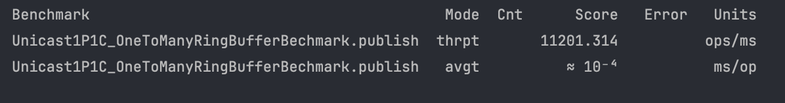

# Benchmark

## OneToOneRingBuffer

### Unicast: 1P – 1C

```shell
./gradlew :lib-benchmark:run-unicast1p1c
```



## Reference

- [BlockingQueueBenchmark.java](https://github.com/LMAX-Exchange/disruptor/blob/master/src/jmh/java/com/lmax/disruptor/BlockingQueueBenchmark.java)
